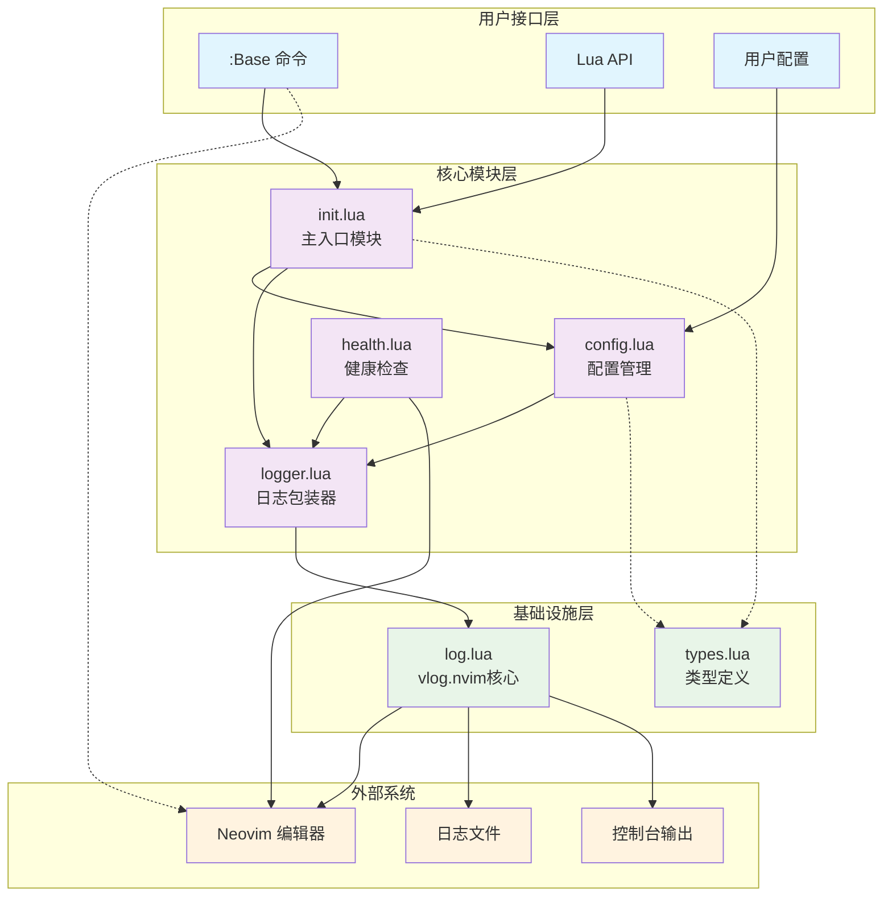
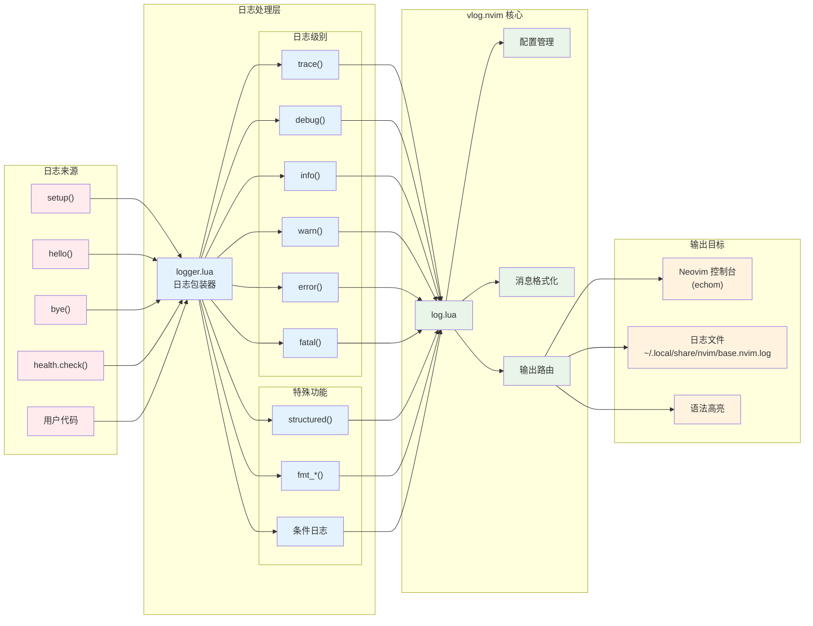
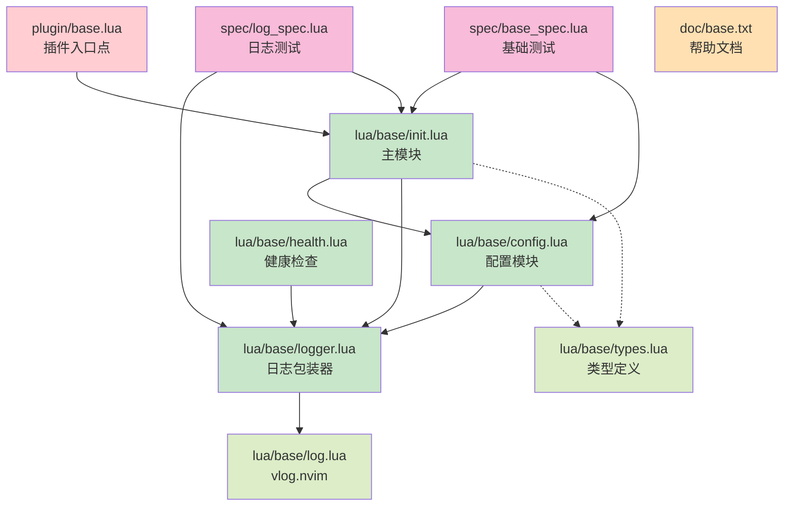
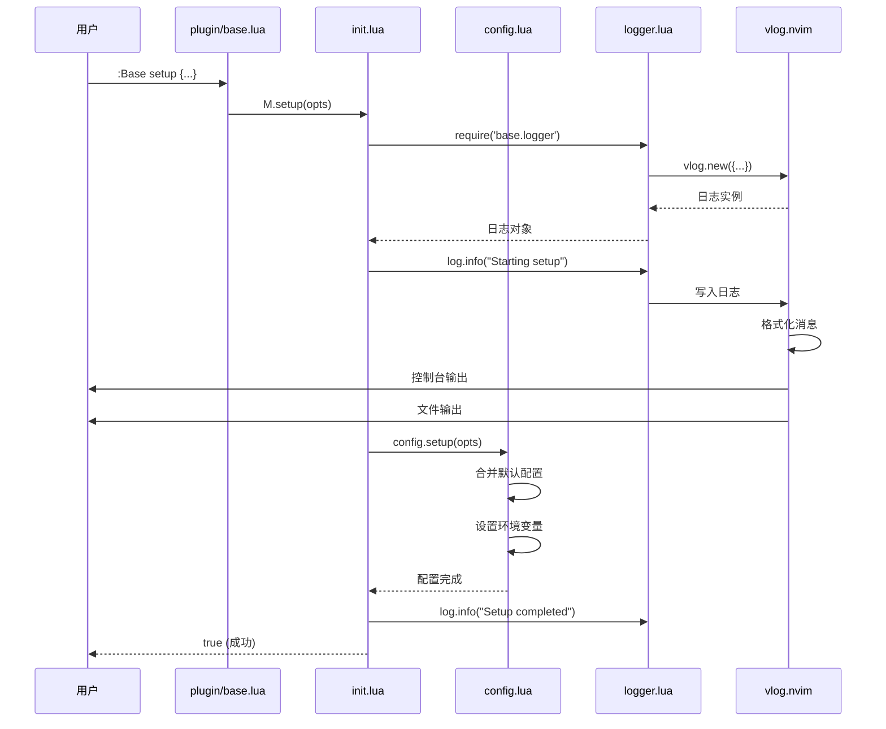
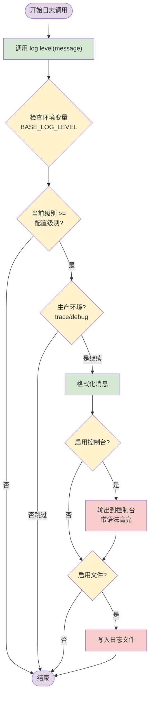

# Base.nvim 架构图

## 系统整体架构

```mermaid
graph TB
    %% 用户接口层
    subgraph "用户接口层"
        CLI[":Base 命令"]
        API["Lua API"]
        CONFIG["用户配置"]
    end

    %% 核心模块层
    subgraph "核心模块层"
        INIT["init.lua<br/>主入口模块"]
        CONF["config.lua<br/>配置管理"]
        HEALTH["health.lua<br/>健康检查"]
        LOGGER["logger.lua<br/>日志包装器"]
    end

    %% 基础设施层
    subgraph "基础设施层"
        VLOG["log.lua<br/>vlog.nvim核心"]
        TYPES["types.lua<br/>类型定义"]
    end

    %% 外部系统
    subgraph "外部系统"
        NVIM["Neovim 编辑器"]
        FILES["日志文件"]
        CONSOLE["控制台输出"]
    end

    %% 连接关系
    CLI --> INIT
    API --> INIT
    CONFIG --> CONF
    
    INIT --> CONF
    INIT --> LOGGER
    HEALTH --> LOGGER
    CONF --> LOGGER
    
    LOGGER --> VLOG
    INIT -.-> TYPES
    CONF -.-> TYPES
    
    VLOG --> NVIM
    VLOG --> FILES
    VLOG --> CONSOLE
    
    HEALTH --> NVIM
    CLI -.-> NVIM

    %% 样式定义
    classDef userLayer fill:#e1f5fe
    classDef coreLayer fill:#f3e5f5
    classDef infraLayer fill:#e8f5e8
    classDef externalLayer fill:#fff3e0

    class CLI,API,CONFIG userLayer
    class INIT,CONF,HEALTH,LOGGER coreLayer
    class VLOG,TYPES infraLayer
    class NVIM,FILES,CONSOLE externalLayer
```

## 日志系统详细架构

```mermaid
graph LR
    %% 日志源
    subgraph "日志来源"
        SETUP["setup()"]
        HELLO["hello()"]
        BYE["bye()"]
        HEALTH_CHECK["health.check()"]
        USER_CODE["用户代码"]
    end

    %% 日志处理层
    subgraph "日志处理层"
        LOGGER_WRAP["logger.lua<br/>日志包装器"]
        
        subgraph "日志级别"
            TRACE["trace()"]
            DEBUG["debug()"]
            INFO["info()"]
            WARN["warn()"]
            ERROR["error()"]
            FATAL["fatal()"]
        end
        
        subgraph "特殊功能"
            STRUCTURED["structured()"]
            FORMATTED["fmt_*()"]
            CONDITIONAL["条件日志"]
        end
    end

    %% vlog 核心
    subgraph "vlog.nvim 核心"
        VLOG_CORE["log.lua"]
        CONFIG_MGR["配置管理"]
        FORMATTER["消息格式化"]
        ROUTER["输出路由"]
    end

    %% 输出目标
    subgraph "输出目标"
        NVIM_CONSOLE["Neovim 控制台<br/>(echom)"]
        LOG_FILE["日志文件<br/>~/.local/share/nvim/base.nvim.log"]
        HIGHLIGHT["语法高亮"]
    end

    %% 连接关系
    SETUP --> LOGGER_WRAP
    HELLO --> LOGGER_WRAP
    BYE --> LOGGER_WRAP
    HEALTH_CHECK --> LOGGER_WRAP
    USER_CODE --> LOGGER_WRAP

    LOGGER_WRAP --> TRACE
    LOGGER_WRAP --> DEBUG
    LOGGER_WRAP --> INFO
    LOGGER_WRAP --> WARN
    LOGGER_WRAP --> ERROR
    LOGGER_WRAP --> FATAL

    LOGGER_WRAP --> STRUCTURED
    LOGGER_WRAP --> FORMATTED
    LOGGER_WRAP --> CONDITIONAL

    TRACE --> VLOG_CORE
    DEBUG --> VLOG_CORE
    INFO --> VLOG_CORE
    WARN --> VLOG_CORE
    ERROR --> VLOG_CORE
    FATAL --> VLOG_CORE

    STRUCTURED --> VLOG_CORE
    FORMATTED --> VLOG_CORE
    CONDITIONAL --> VLOG_CORE

    VLOG_CORE --> CONFIG_MGR
    VLOG_CORE --> FORMATTER
    VLOG_CORE --> ROUTER

    ROUTER --> NVIM_CONSOLE
    ROUTER --> LOG_FILE
    ROUTER --> HIGHLIGHT

    %% 样式
    classDef sourceLayer fill:#ffebee
    classDef processLayer fill:#e3f2fd
    classDef coreLayer fill:#e8f5e8
    classDef outputLayer fill:#fff3e0

    class SETUP,HELLO,BYE,HEALTH_CHECK,USER_CODE sourceLayer
    class LOGGER_WRAP,TRACE,DEBUG,INFO,WARN,ERROR,FATAL,STRUCTURED,FORMATTED,CONDITIONAL processLayer
    class VLOG_CORE,CONFIG_MGR,FORMATTER,ROUTER coreLayer
    class NVIM_CONSOLE,LOG_FILE,HIGHLIGHT outputLayer
```

## 模块依赖关系

```mermaid
graph TD
    %% 插件入口
    PLUGIN["plugin/base.lua<br/>插件入口点"]
    
    %% 主要模块
    INIT["lua/base/init.lua<br/>主模块"]
    CONFIG["lua/base/config.lua<br/>配置模块"]
    HEALTH["lua/base/health.lua<br/>健康检查"]
    LOGGER["lua/base/logger.lua<br/>日志包装器"]
    
    %% 基础模块
    VLOG["lua/base/log.lua<br/>vlog.nvim"]
    TYPES["lua/base/types.lua<br/>类型定义"]
    
    %% 测试
    TESTS["spec/base_spec.lua<br/>基础测试"]
    LOG_TESTS["spec/log_spec.lua<br/>日志测试"]
    
    %% 文档
    DOC["doc/base.txt<br/>帮助文档"]
    
    %% 依赖关系
    PLUGIN --> INIT
    INIT --> CONFIG
    INIT --> LOGGER
    HEALTH --> LOGGER
    CONFIG --> LOGGER
    LOGGER --> VLOG
    
    %% 类型依赖（虚线表示类型引用）
    INIT -.-> TYPES
    CONFIG -.-> TYPES
    
    %% 测试依赖
    TESTS --> INIT
    TESTS --> CONFIG
    LOG_TESTS --> LOGGER
    LOG_TESTS --> INIT
    
    %% 样式
    classDef entryPoint fill:#ffcdd2
    classDef coreModule fill:#c8e6c9
    classDef baseModule fill:#dcedc8
    classDef testModule fill:#f8bbd9
    classDef docModule fill:#ffe0b2

    class PLUGIN entryPoint
    class INIT,CONFIG,HEALTH,LOGGER coreModule
    class VLOG,TYPES baseModule
    class TESTS,LOG_TESTS testModule
    class DOC docModule
```

## 配置流程图

```mermaid
sequenceDiagram
    participant User as 用户
    participant Plugin as plugin/base.lua
    participant Init as init.lua
    participant Config as config.lua
    participant Logger as logger.lua
    participant VLog as vlog.nvim

    User->>Plugin: :Base setup {...}
    Plugin->>Init: M.setup(opts)
    
    Init->>Logger: require('base.logger')
    Logger->>VLog: vlog.new({...})
    VLog-->>Logger: 日志实例
    Logger-->>Init: 日志对象
    
    Init->>Logger: log.info("Starting setup")
    Logger->>VLog: 写入日志
    VLog->>VLog: 格式化消息
    VLog->>User: 控制台输出
    VLog->>User: 文件输出
    
    Init->>Config: config.setup(opts)
    Config->>Config: 合并默认配置
    Config->>Config: 设置环境变量
    Config-->>Init: 配置完成
    
    Init->>Logger: log.info("Setup completed")
    Init-->>User: true (成功)
```

## 日志级别控制流程

```mermaid
flowchart TD
    START([开始日志调用])
    
    CALL["调用 log.level(message)"]
    
    ENV_CHECK{检查环境变量<br/>BASE_LOG_LEVEL}
    
    LEVEL_CHECK{当前级别 >=<br/>配置级别?}
    
    PROD_CHECK{生产环境?<br/>trace/debug}
    
    FORMAT["格式化消息"]
    
    CONSOLE_CHECK{启用控制台?}
    CONSOLE_OUT["输出到控制台<br/>带语法高亮"]
    
    FILE_CHECK{启用文件?}
    FILE_OUT["写入日志文件"]
    
    END([结束])
    
    START --> CALL
    CALL --> ENV_CHECK
    ENV_CHECK --> LEVEL_CHECK
    
    LEVEL_CHECK -->|是| PROD_CHECK
    LEVEL_CHECK -->|否| END
    
    PROD_CHECK -->|否跳过| END
    PROD_CHECK -->|是继续| FORMAT
    
    FORMAT --> CONSOLE_CHECK
    CONSOLE_CHECK -->|是| CONSOLE_OUT
    CONSOLE_CHECK -->|否| FILE_CHECK
    
    CONSOLE_OUT --> FILE_CHECK
    FILE_CHECK -->|是| FILE_OUT
    FILE_CHECK -->|否| END
    
    FILE_OUT --> END

    %% 样式
    classDef decisionNode fill:#fff2cc
    classDef processNode fill:#d5e8d4
    classDef outputNode fill:#f8cecc
    classDef startEndNode fill:#e1d5e7

    class ENV_CHECK,LEVEL_CHECK,PROD_CHECK,CONSOLE_CHECK,FILE_CHECK decisionNode
    class CALL,FORMAT processNode
    class CONSOLE_OUT,FILE_OUT outputNode
    class START,END startEndNode
```